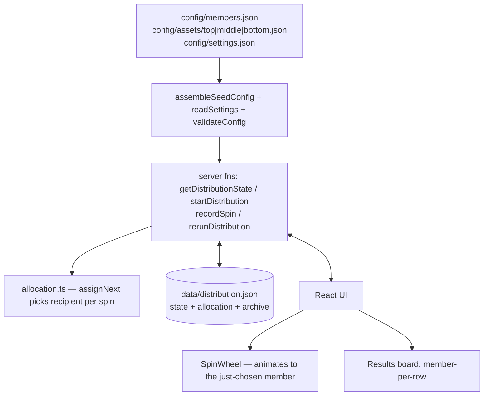

# Heritage Land Distribution — Product & Architecture Doc

> Status: **Implemented**. This document describes what the app does, how it is
> built, and how to run/deploy it. It started life as an implementation plan; it
> is now the living reference for the delivered system. Update it alongside code
> changes.

## 1. Problem Statement

A fullstack web app that fairly distributes land documents among members
through a "spin the wheel" reveal. Documents are classified as **top / middle /
bottom** and processed in that order. The fair allocation is computed up front;
the wheel only _reveals_ the predetermined result.

The app supports two switchable **allocation modes**, selected at runtime via
`config/settings.json` (`allocationMode`) or the `ALLOCATION_MODE` env var:

- **`strict`** (default): **top** and **middle** must divide evenly across
  members — otherwise the run is blocked with a clear validation error.
  **bottom** distributes evenly, with leftover documents randomly assigned to
  distinct members.
- **`compensation`**: no divisibility requirement. A member who falls short of
  the would-be even share in a class is compensated with `COMPENSATION_FACTOR`
  (= 3) documents of the next lower class, cascading top → middle → bottom. The
  run is only blocked if a lower class is too small to pay the compensation it
  owes.

Other invariants (shared by both modes):

- Members and land documents are defined in JSON config files.
- The final distribution persists on the server and is locked once committed,
  with a guarded rerun flow that archives the previous result.
- The app is gated behind a single shared **password**.

## 2. Tech Stack

- **TanStack Start** (`@tanstack/react-start` 1.168.x) + **TanStack Router**
  (`@tanstack/react-router` 1.170.x), TypeScript, React 19.
- **Vite 7** build tool (Vite-native Start; Nitro not used).
- **Tailwind CSS v4** + **shadcn/ui** (button, card, dialog).
- **Server functions** (`createServerFn`) backed by JSON files — no database.
- **Config** is split per concern (members, per-class assets, branding) for
  maintainability — see §8.
- **Auth**: single shared password, sealed session cookie via h3 `useSession`
  (re-exported by `@tanstack/react-start/server`).
- **jsPDF** + **jspdf-autotable** for per-member PDF export (client-side).
- **Vitest 4** (+ Testing Library) for unit and component tests.
- **Prettier** for formatting (`npm run format` / `format:check`).
- **srvx** serves the production build (SSR fetch handler + static assets).

> Requires **Node ≥ 20.19 or ≥ 22.12** (Vite 7 engine constraint). The Docker
> image uses Node 22.

## 3. Domain Model

See `src/lib/types.ts` for the authoritative definitions.

- `Member`: `{ id, name }`
- `Asset` (a land document): `{ certificateNumber /* primary key */,
name /* owner of the document */, location, area /* m² */, classification }`
- `Classification`: `'top' | 'middle' | 'bottom'`
- `AllocationMode`: `'strict' | 'compensation'` — selects the allocation rule
  (see §4); resolved from `config/settings.json` / `ALLOCATION_MODE`.
- `RevealItem`: `{ certificateNumber, classification, memberId }` — one entry per
  document, in reveal order (top → middle → bottom).
- `DistributionState`: `{ status, allocation, revealedCount, startedAt,
committedAt, archive }`.

## 4. Fairness / Allocation Rules

Two code paths share the same fairness rules:

- `computeAllocation` (in `src/lib/allocation.ts`) builds a full sequence up front
  — used **only** by the `/debug` preview.
- `assignNext` / `preassignedItems` (same file) drive the **live distribution**:
  the recipient of each document is decided **per spin**, not precomputed.

Both honor the active `AllocationMode` (`strict` | `compensation`), resolved by
`readSettings()` and threaded through `loadConfig` → server functions →
`assignNext` / `validateConfig`. The default is `strict`.

Common to both modes:

- Group documents by classification; process **top → middle → bottom**.
- `preassignedTo` (top-only): pinned documents are **placed automatically when
  the run starts** (no spin) and **count toward that member's top quota**. Pinned
  items carry `preassigned: true` and show a 📌 badge. Validation blocks
  over-allocation and non-top preassignments.
- For each live spin, `assignNext` picks the next undistributed document (in
  order) and a random member among those still **eligible**. The wheel animates
  to the member the server just chose.

### `strict` mode

- **top / middle**: exact even split; `count % memberCount` must be 0 (else the
  run is blocked at validation).
- **bottom**: each member gets `floor(count / memberCount)`; the
  `count % memberCount` leftovers go to randomly chosen **distinct** members.

### `compensation` mode

- For each class, a compensation pool is **reserved first**: every member who
  fell short of the would-be even share in the previous class is owed
  `COMPENSATION_FACTOR` (= 3) documents (`compensationOwed`, cascading
  recursively bottom ← middle ← top; `top` owes nothing). In the live draw these
  owed members are drawn **first** within the class, so a member who missed a
  higher class receives their compensation at the start of the next class's spins.
- The **remaining** documents are then distributed evenly across **all** members
  (compensated members included): everyone reaches `floor(remaining /
memberCount)`, then `remaining % memberCount` leftovers go to distinct members.
- A member who only reaches the floor (does not win a leftover) is "short" and is
  compensated in the next class. Because the 3× rate equals the value ratio
  (1 top = 3 middle = 9 bottom), every member ends with **equal total value**.
- Validation requires each lower class to hold enough documents to pay the
  compensation owed by the class above it; otherwise the run is blocked.

> Worked example — 15 members, 14 top / 19 middle / 57 bottom:
> 1 member misses top → +3 middle (reserved), the other 14 each get 1 top.
> Middle: reserve 3, distribute the remaining 16 evenly (everyone +1, 1 leftover
> spins) → 14 members fall short of the 2nd middle cycle → +3 bottom each.
> Bottom: reserve 42, distribute the remaining 15 evenly. Every member ends at
> 16 value points.

## 5. Architecture



### Server functions (`src/server/distribution.ts`)

- `getDistributionState` (GET) — read current persisted state.
- `startDistribution` (POST) — validate → place preassigned documents → persist `draft`.
- `recordSpin` (POST) — assign the next document to a randomly chosen eligible
  member (decided now); transitions to `committed` when all are assigned.
- `rerunDistribution` (POST) — only on a committed run: archive it and start fresh.

State-transition logic lives in `src/server/stateMachine.ts` (pure-ish,
file-path & rng injectable for tests); persistence in `src/server/store.ts`.

## 6. Distribution State Machine

```mermaid
stateDiagram-v2
    [*] --> empty
    empty --> draft: startDistribution (place preassigned)
    draft --> in_progress: first recordSpin
    in_progress --> in_progress: recordSpin (assign next, decided live)
    in_progress --> committed: final document assigned
    committed --> draft: rerunDistribution (archive + restart)
    empty --> blocked: validation fails (strict: top/middle not divisible;\ncompensation: lower class too small to compensate)
```



## 7. Routes & Auth

Every route except `/login` is gated by a `beforeLoad` guard in
`src/routes/__root.tsx` that calls `getAuth()` and redirects unauthenticated
visitors to `/login`.

- `/login` — password form; `login()` server fn validates against
  `APP_PASSWORD` and seals the session cookie.
- `/` — dashboard: status summary, member/document counts, navigation.
- `/distribute` — the live draw: each spin asks the server to pick the next
  recipient (decided then, not precomputed), the wheel animates to them, and the
  member-per-row board fills in. Pinned documents are placed automatically at the
  start (📌 badge). Includes manual **Spin** + **Auto-play** and a guarded rerun
  dialog. (PDF export lives on the report page.)
- `/assets` — land documents grouped by classification (Top / Middle / Bottom),
  collapsible accordion tables with certificate number, owner, location, and area.
- `/report` — committed distribution summary per member, with per-member and
  bulk PDF export.
- `/debug` — prints the computed allocation and per-member tallies. Reachable by
  URL but intentionally **not linked** from the nav.

Auth server functions live in `src/server/auth.ts`; the sealed-session helper in
`src/server/session.ts`. Configure via env: `APP_PASSWORD` (default `heritage`)
and `SESSION_SECRET` (≥ 32 chars; override in production).

**Branding** — visible brand strings (logo text, brand name, title, login
tagline) come from `config/branding.json`, loaded by `loadBranding()` in the root
route's loader and read across the nav, login, dashboard, and document `<title>`.
Missing/invalid file falls back to built-in defaults.

## 8. Project Structure

```
config/
  members.json              # member list (id, name)
  branding.json             # brand strings (logoText, brandName, title, tagline)
  settings.json             # { "allocationMode": "strict" | "compensation" }
  assets/
    top.json                # top-tier documents (preassignedTo optional)
    middle.json             # middle-tier documents
    bottom.json             # bottom-tier documents
data/
  distribution.json         # persisted run state (gitignored; Docker volume)
src/
  lib/                      # types, validation, allocation, pdf (pure / client)
  server/                   # config, store, stateMachine, distribution, auth, session
  components/               # SpinWheel + shadcn/ui primitives
  routes/                   # __root, index, login, distribute, report, debug
  router.tsx                # getRouter() factory consumed by TanStack Start
  test/                     # vitest unit + component tests
docs/
  PRD.md                    # this document
Makefile                    # common workflow shortcuts
Dockerfile                  # multi-stage production image (Node 22)
docker-compose.yml          # deployment compose file
```

## 9. Running Locally

```bash
make install    # npm install
make dev        # http://localhost:3000  (default password: heritage)
make test
make format
make typecheck
make build
make start      # build + serve production
```

Or use npm scripts directly — see `package.json`.

## 10. Deployment (Docker)

```bash
make docker-rebuild   # build image + start on :3000
make docker-logs
make docker-down
```

Key compose behaviour:

- `config/` is bind-mounted read-only — edit documents without rebuilding.
- `data/` is a named volume (`heritage-data`) — state survives restarts.
- Health check hits `/login` (always 200).
- Override env vars in `.env` or the compose file:
    - `APP_PASSWORD` — access password (default `heritage`; **change in production**)
    - `SESSION_SECRET` — sealing key for the session cookie (must be ≥ 32 chars; **change in production**)

## 11. Open Decisions / Future Work

- Rerun archive keeps full history; consider a retention cap.
- Seed config is file-based; a future version could support an upload UI.
- Single shared password; multi-user auth could be added if needed.
